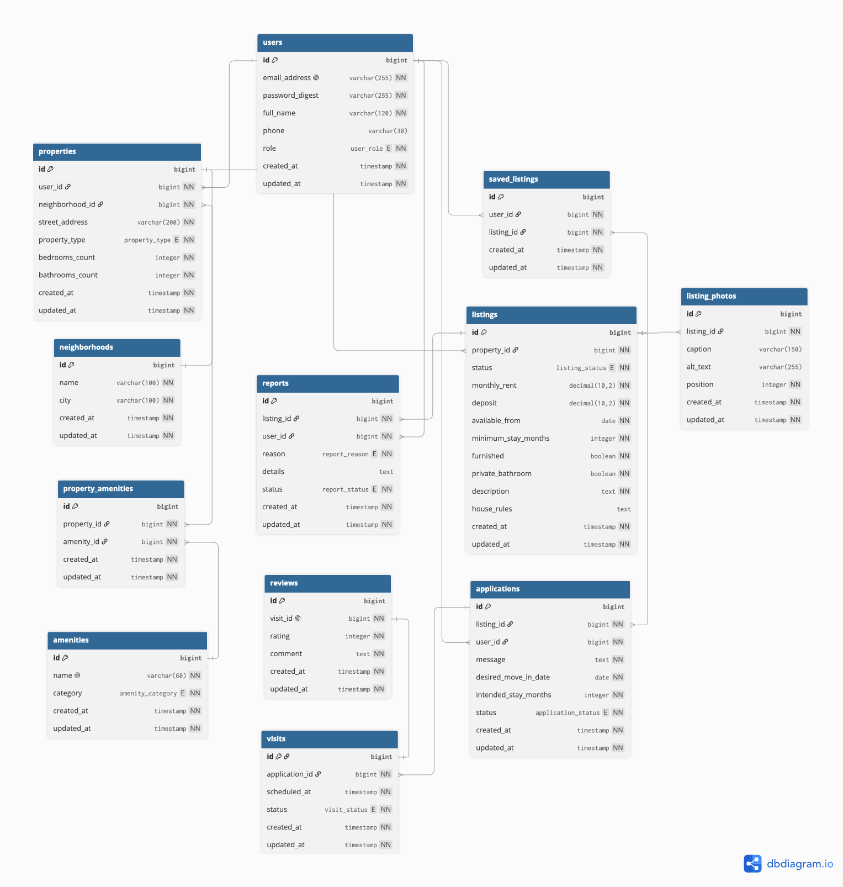

# webtech-assignments

# Roomies

A platform for renting rooms in shared homes. Hosts publish the free rooms in
their property; seekers browse them, apply, arrange a visit, and move in.

Semester project for **Web Technologies**, semester 202620.

---

## Team

| Name |
| --- |
| Javiera Carrasco Bastías|
| Andres Concha Arriaga|
| Rodrigo Ruz Vasquez|

---

## Repository structure

```
.
├── docs/
│   ├── user-stories.md       User stories for visitors, members and moderators
│   ├── domain-model.dbml     Domain model source, written in DBML
│   ├── domain-model.png      Diagram exported from dbdiagram.io
│   └── design-decisions.md   Modelling decisions and assumptions
├── landing/
│   ├── index.html            Static landing page
│   ├── css/                  Custom stylesheets
└── README.md
```

---

## Domain model



**Online diagram:** https://dbdiagram.io/d/Diagram-model-Roomies-6aa8469e36f9982564907f49 

The source is in [`docs/domain-model.dbml`](docs/Domain-Model.dbml) and can be
re-rendered at any time by pasting its contents into
[dbdiagram.io](https://dbdiagram.io).

The model has twelve entities. Its backbone is the chain that follows a room
from publication to move-in:

```
users → properties → listings → applications → visits → reviews

