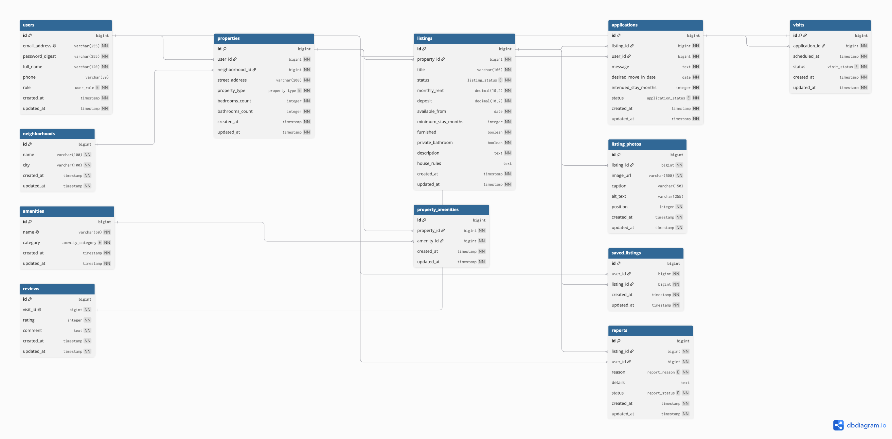

# webtech-assignments

# Roomies

A platform for renting rooms in shared homes. Hosts publish the free rooms in
their property; seekers browse them, apply, arrange a visit, and move in.

Semester project for **Web Technologies**, semester 202620.

---

## Team

| Name |
| --- |
| Javiera Carrasco Bastías|
| Andres Concha Arriaga|
| Rodrigo Ruz Vasquez|

---

## Repository structure

```
.
├── docs/
│   ├── user-stories.md        User stories for visitors, members and moderators
│   ├── Domain-Model.dbml      Domain model source, written in DBML (updated for Assignment 2)
│   ├── images/                Diagram exported from dbdiagram.io
│   └── desing-decisions.md    Modelling decisions, assumptions and changes since Assignment 1
├── roomies/                   Rails 8 application (Assignment 2 onwards)
└── README.md
```

## Running the application

The application lives in [`roomies/`](roomies). Its [README](roomies/README.md) has the full
instructions to install dependencies, create and seed the database, and start the app with `bin/dev`.

```bash
cd roomies
bundle install && yarn install
bin/rails db:create db:migrate db:seed
bin/dev            # http://localhost:3000
```

---

## Domain model



**Online diagram:** https://dbdiagram.io/d/Diagram-model-Roomies-6aa8469e36f9982564907f49 

The source is in [`docs/domain-model.dbml`](docs/Domain-Model.dbml) and can be
re-rendered at any time by pasting its contents into
[dbdiagram.io](https://dbdiagram.io).

The model has twelve entities. Its backbone is the chain that follows a room
from publication to move-in:

```
users → properties → listings → applications → visits → reviews

